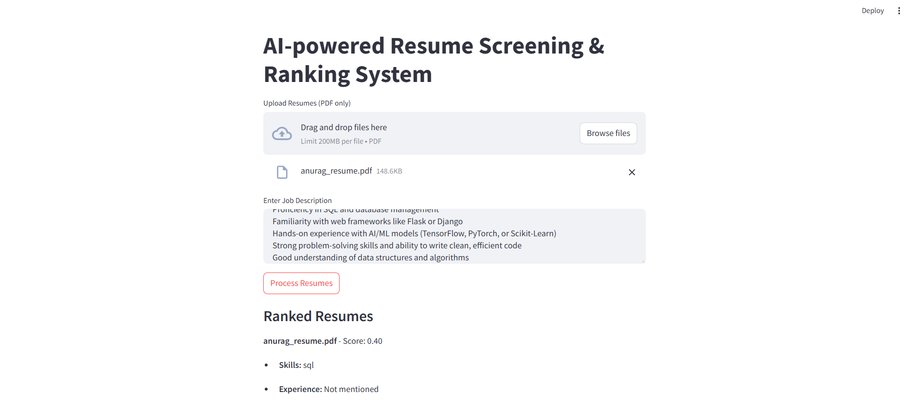

# 🚀 AI-Powered Resume Screening & Ranking System

An **AI-driven Resume Screening System** built with **Streamlit**, using **NLP and Machine Learning** to analyze and rank resumes based on job descriptions.

  

## ✨ Features  
✅ Upload multiple resumes (PDF format)  
✅ Extract **Skills, Experience, and Education** from resumes  
✅ Rank resumes based on **job description relevance**  
✅ Uses **TF-IDF & Cosine Similarity** for ranking  
✅ Simple UI built with **Streamlit**  

---
